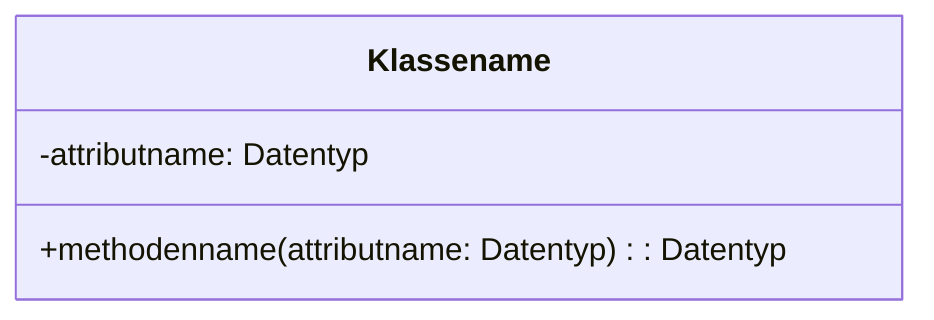
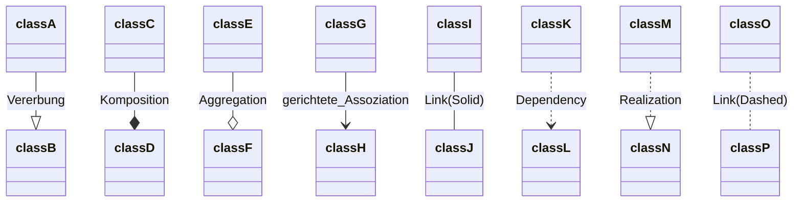
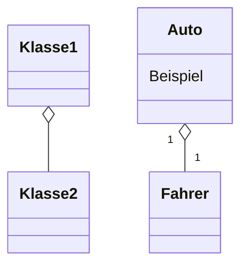
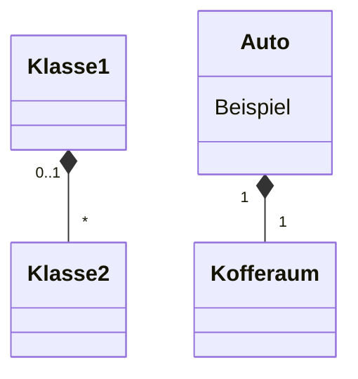
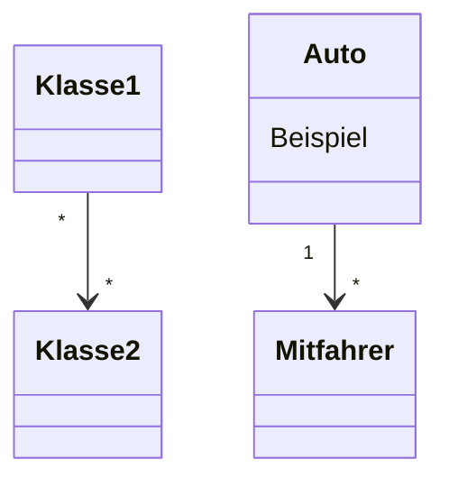
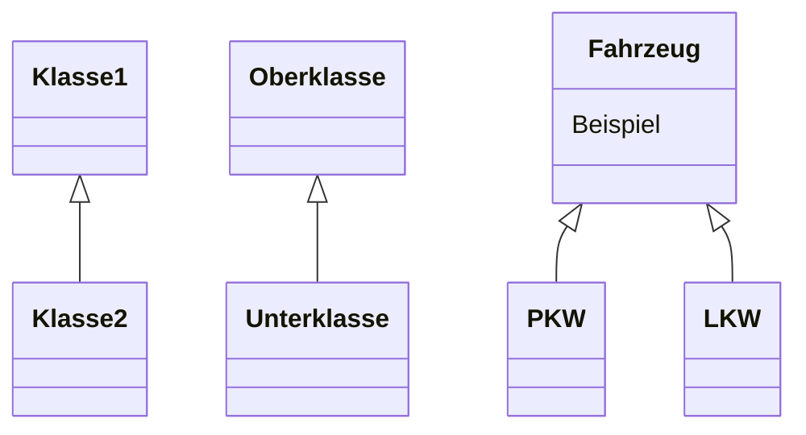
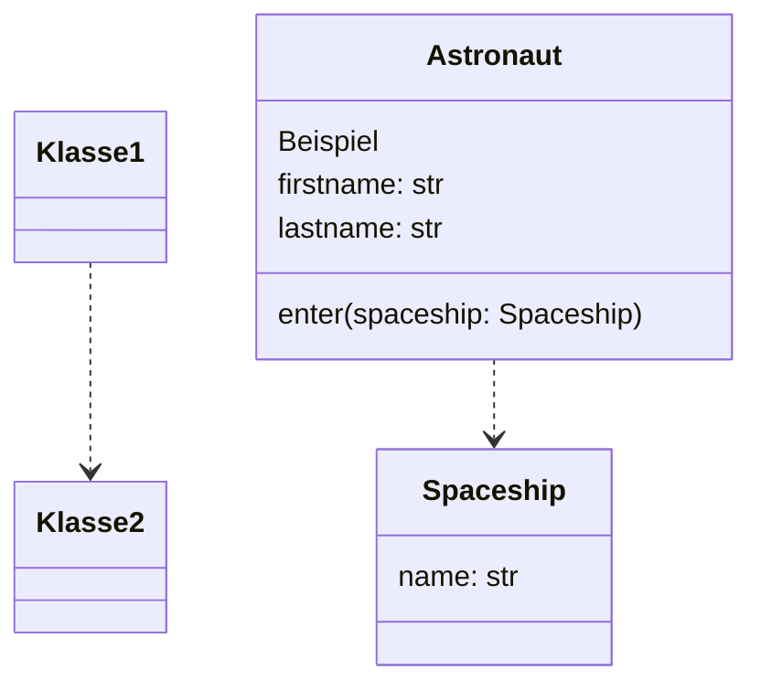
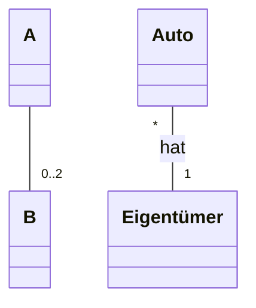
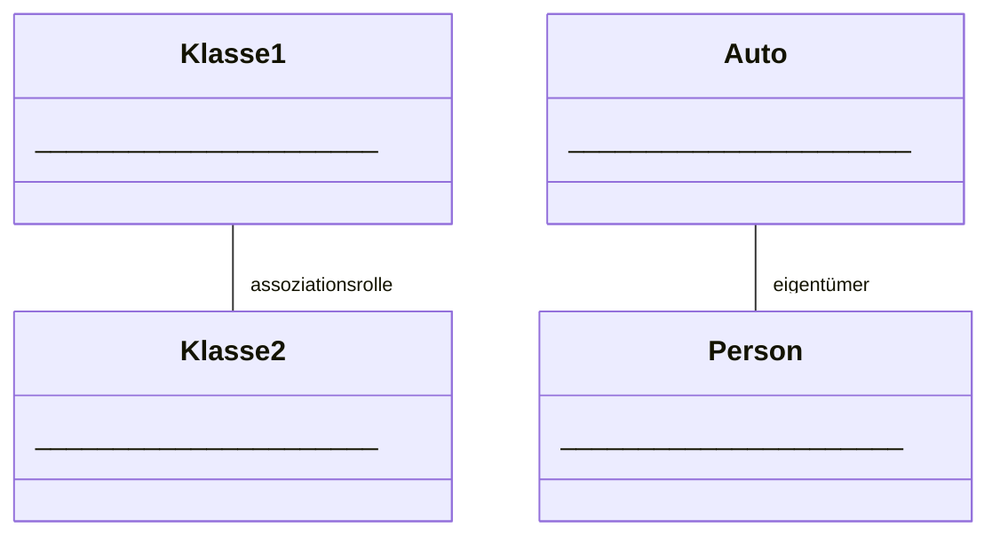

# KLASSENDIAGRAMME UND OBJEKTDIAGRAMME

Klassen in Klassendiagrammen werden so dargestellt:



Gute Beschreibung mit Python Beispielen: [2.5. UML Class Diagram &mdash; Python: From None to Machine Learning](https://python.astrotech.io/design-patterns/uml/class-diagram.html)

## Datenkapselung

Die Sichtbarkeit wird an den Anfang des Attributs oder der Methode gesetzt. Sie wird mit folgenden Zeichen dargestellt:

- `+` public
- `-` private
- `#` protected
- `~` package

## Klassenattribute und Klassenmethoden

Klassenattribute und -methoden haben bei jedem Objekt den selben Wert. In UML werden diese Unterstrichen.

<u>klassenattributname: Datentyp</u>

Beispiel in Python für ein Klassenattribute und -methode:

```python
class Klassenname:
    klassenattribute: int

    @staticmethod
    def get_klassenattribute() -> int:
        return klassenattribute
```

## Klassenverknüpfungen/Assoziation und Objektbeziehung

- Assoziation bei Klassendiagrammen

- Objektbezeichnung bei Objektdiagrammen

Die Verknüpfung zwischen Klassen oder Objekten kann wie folgt dargestellt werden:



Gute Beschreibung der Klassenverknüpfungen mit Python Beispielen [2.4. UML Relationship &mdash; Python: From None to Machine Learning](https://python.astrotech.io/design-patterns/uml/relationship.html)

### Aggregation



`--o` 

Ein Objekt der Klasse 1 besitzt/hat ein Objekt der Klasse 2. Beide Objekte exitstieren weiter, auch wenn die Beziehung aufgelöst wird.

- Klasse 1 ist eine Aggregationsklasse

- Klasse 2 ist eine Teilklasse

**Beispiel:** Ein Auto besitzt einen Fahrer.

```python
class Fahrer:
    pass

class Auto:
    def __init__(self) -> None:
        self.fahrer: Fahrer

    def set_fahrer(self, fahrer: Fahrer)
        self.fahrer = fahrer

klaus = Fahrer()
benz = Auto()
benz.set_fahrer(klaus)
```

### Komposition



`--*`

Eine Komposition ist eine starke Verbindung, in der eine Klasse abhängig von der anderen Klasse ist.
Klasse 2 ist abhängig von Klasse 1 und Kann nicht ohne die Klasse existieren.

**Beispiel** Der Kofferraum kann nicht ohne das Auto existieren.

```python
class Kofferraum:
    def __del__(self):
        print("Kofferraum zerstört")

class Auto:
    def __init__(self):
        self.__kofferraum = Kofferraum()

    def __del__(self):
        print("Auto zerstört")

benz = Auto()
del benz
```

### Gerichtete Assoziation



`-->`

Der Pfeil zeigt in Richtung der Klasse, die von der Beziehung beeinflusst wird. Die Klasse die beeinflusst wird, weiß nichts über die andere Klasse.

**Beispiel:** Eine Person kann eine Adresse haben und diese verändern. Die Adresse kann aber nicht die Person verändern.

```python
class Person:
    def __init__(self, name):
        self.name = name
        self.adresse = None 

class Adresse:
    def __inti__(self, straße, stadt):
        self.straße = straße
        self.stadt = stadt


haus = Adresse("Weilerhausen", "Köln")
klaus = Person("Klaus")
klaus.adresse = haus
```

### Vererbung



`--|>`

Klasse 2 erbt Attribute und Methoden von Klasse 2. 

```python
class Pkw(Fahrzeug):
    pass
```

### Dependency



**Beispiel:**

```python
class Spaceship:
    name: str


class Astronaut:
    firstname: str
    lastname: str

    def enter(spaceship: Spaceship):
        pass
```

## Multiplizitäten

Jedes Objekt von A steht mit x Objekten von B in Beziehung. Wird bei einem Objektdiagramm nicht mehr benötigt.

- `3`    *genau drei*
- `0..2`    *keiner bis zwei
- `*`     *keiner oder beliebig viele*
- `2,3,7` 



**Beispiel:** Ein Auto hat ein Eigentümer, aus diesem Grund steht bei Eigentümer eine 1.  Ein Eigentümer kann aber mehrere Autos besizen, deshalb steht bei Auto ein Stern.

## Assoziatinsrollen


