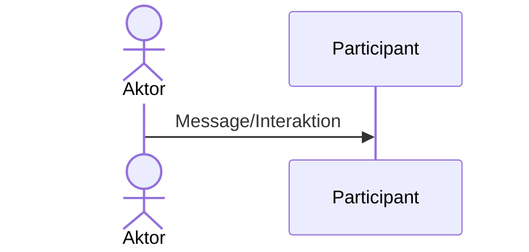

# SEQUENZDIAGRAMME

Sequenzdiagramme zeigen auf wie Funktionen oder Klassen miteinander interagieren. Der Peil nach untern stellt die Lifeline dar, je weiter unten, umsom mehr Zeit ist vergangen.



**ATM Beispiel:**

```mermaid

```
